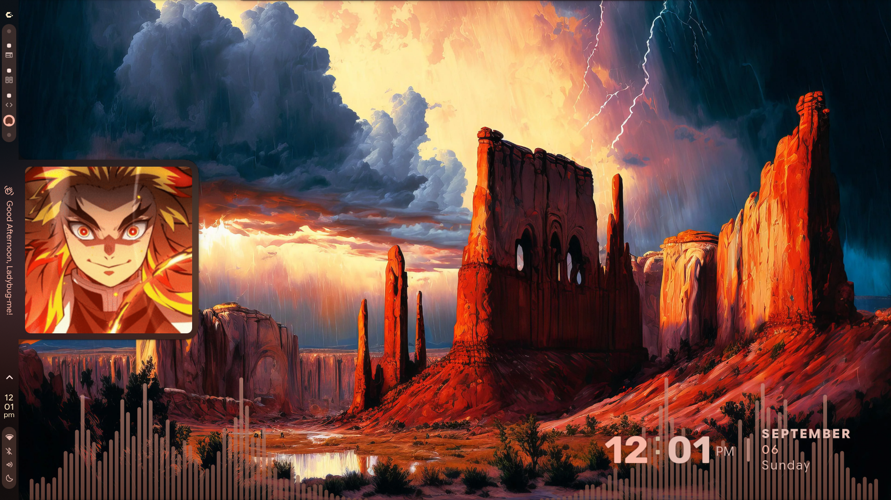

<div align="center">


# C A E L E S T I A

### A KDE Plasma port of the caelestia shell


### A KDE Plasma port of the caelestia shell

### !Este es un fork personal para adaptar el repositorio "caelestia-dots-kde" a void linux doy creditos al creador original ladybug-me.

### IMPORTANTE nose si funcione no hice pruebas


[](https://archlinux.org)
[](https://fedoraproject.org)
[](https://debian.org)
[](https://voidlinux.org)
[](https://kde.org/plasma-desktop)
[](LICENSE)


</div>

---

## About

A community port of the [Caelestia Hyprland dotfiles](https://github.com/caelestia-dots/caelestia) to **KDE Plasma 6**, bringing the ethereal caelestia aesthetic to a full desktop environment with broader hardware and software compatibility.

## Installation

**Requirements:** Arch-based distro, Fedora, Debian/Ubuntu or **Void Linux** (glibc or musl) · KDE Plasma 6.0+

```bash
curl -fsSL https://raw.githubusercontent.com/rarr111110-creator/caelestia-dots-kde-void/main/install.sh | sh
```

### Void Linux notes

Void Linux is supported with its own package set (**XBPS**) and init system (**runit**):

- Packages are installed with `sudo xbps-install` (no pacman/dnf/apt anywhere on Void paths).
- There is no systemd: user daemons (`cliphist`, `ydotoold`, `kde-material-you-colors`) are
  started via XDG autostart entries under `~/.config/autostart/` instead of
  `systemctl --user` units.
- A few packages not available in the Void repositories are built from source during
  installation: `ydotool`, `libcava`, `app2unit`, `Darkly`, and `caelestia-cli`.
  The `adw-gtk3` theme is fetched from its upstream release tarball.
- On Void **musl** the prebuilt installer binary is skipped automatically (it is a glibc
  build) and the installer UI is compiled locally instead.
- Session/power management works through **elogind** (present on Void KDE installs);
  suspend/poweroff buttons in the shell talk to logind over D-Bus, so no systemd is needed.
- PipeWire/WirePlumber are expected to be set up the standard Void way (XDG autostart,
  see the Void handbook) — the installer does not manage system audio services.
- Void's `quickshell` package tracks stable releases, not git master. If the shell
  reports missing QML features after updating, build quickshell from source.
- Ollama is optional; on Void a native runit service is registered at `/etc/sv/ollama`
  and enabled via `/var/service`.

If you install manually on Void, the minimum requirements are:

```bash
sudo xbps-install -Sy git curl
git clone https://github.com/rarr111110-creator/caelestia-dots-kde-void.git ~/caelestia-dots-kde
cd ~/caelestia-dots-kde && bash scripts/setup.sh
```

### Updating

- **GUI:** Shell Settings -> Updates -> select branch -> Install Updates
- **CLI:** `bash update.sh` and choose `main` (stable) or `dev` (bleeding edge)

Shell settings are preserved across updates.

### Uninstalling

```bash
bash ./uninstall.sh
```

## Screenshots

https://github.com/user-attachments/assets/4c3e20c9-5050-4cc8-8e9c-32fd0594ac8b

| Shell | Theming |
|:---:|:---:|
|  |  |

## Keybinds

| Shortcut | Action |
| --- | --- |
| `Super + /` | Keybind cheatsheet |
| `Super + Enter` | Terminal |
| `Super + 1–5` | Switch workspace |
| `Super + Space` | App launcher |
| `Super + B` | Notification sidebar |
| `Super + V` | Clipboard history |
| `Super + Shift + S` | Screenshot |
| `Super + Shift + A` | Google Lens |
| `Super + Shift + D` | Text recognition |
| `Super + Ctrl + S` | Screen recorder |
| `Super + Shift + C` | Color picker |
| `Super + Shift + V` | Emoji selector |

## Tech Stack

| Component | Role |
| --- | --- |
| [KDE Plasma 6](https://kde.org/plasma-desktop) | Desktop environment |
| [Quickshell](https://quickshell.outfoxxed.me/) | Widget system |
| [Darkly](https://github.com/vinceliuice/Darkly) | Plasma style & window decoration |
| [Kvantum](https://github.com/tsujan/Kvantum) | Qt application theming |
| [Krohnkite](https://github.com/esjeon/krohnkite) | Optional tiling |

## Customization

<details>
<summary><b>Wallpaper & colors</b></summary>

Use the built-in wallpaper manager (`Super`, then `>Wallpaper`). Dynamic color schemes update automatically with your wallpaper. Do **not** use the default KDE wallpaper manager.

To browse all settings, `Super`, then `>Settings` to launch the Nexus settings panel - navigate to **Appearance** for wallpaper, colors, and themes.

</details>

<details>
<summary><b>Keyboard shortcuts</b></summary>

Use the built-in keyboard shortcut manager (`Super`, then `>Settings` to launch the Nexus settings panel - navigate to **Shortcuts**).

</details>

<details>
<summary><b>Greeter animations</b></summary>

Replace `morning.gif`, `afternoon.gif`, `evening.gif`, and `night.gif` in `shell/assets/`, then run `bash scripts/08-build-shell.sh`.

</details>

## Troubleshooting

| Problem | Fix |
| --- | --- |
| Widgets not appearing | Log out and back in, or run `caelestia shell -d` |
| Colors not applying | systemd distros: `systemctl status --user kde-material-you-colors.service`. Void/runit: check `pgrep -af kde-material-you-colors` (it autostarts via `~/.config/autostart/kde-material-you-colors.desktop`) |
| Install failed mid-way | Re-run `bash ./scripts/setup.sh` |
| Full reset needed | See [TROUBLESHOOTING.md](docs/TROUBLESHOOTING.md) |

For detailed debug logs, enable Debug Mode in Nexus -> About -> Advanced, then run `caelestia shell -l`.

## Thanks to

<!-- contributors-start -->
<table><tr>
<td width="50%">

### PRs

| Contributor | PRs |
| --- | ---: |
| [WinTone01](https://github.com/WinTone01) | 46 |
| [Vinax89](https://github.com/Vinax89) | 5 |
| [0x0nYx](https://github.com/0x0nYx) | 1 |
| [tomjod](https://github.com/tomjod) | 1 |
| [Peace-W](https://github.com/Peace-W) | 1 |
| [jedrikjames](https://github.com/jedrikjames) | 1 |
| [Klivan49](https://github.com/Klivan49) | 1 |
| [gitxpresso](https://github.com/gitxpresso) | 1 |

</td>
<td width="50%">

### Issues

| Contributor | Issues |
| --- | ---: |
| [0x0nYx](https://github.com/0x0nYx) | 106 |
| [Kyedae](https://github.com/Kyedae) | 17 |
| [bubbleo0](https://github.com/bubbleo0) | 12 |
| [RaceConditionWinner](https://github.com/RaceConditionWinner) | 10 |
| [KhanhNguyen1603](https://github.com/KhanhNguyen1603) | 9 |
| [arceus4526](https://github.com/arceus4526) | 6 |
| [RealNath](https://github.com/RealNath) | 6 |
| [francisco-tato](https://github.com/francisco-tato) | 5 |

</td>
</tr></table>

<!-- contributors-end -->

## Credits

- [Caelestia](https://github.com/caelestia-dots) - original design language and dotfiles
- [ladybug-me](https://github.com/ladybug-me) - KDE port lead & maintainer
- [0xSolanaceae](https://github.com/0xSolanaceae) - maintainer
- [dim-ghub](https://github.com/dim-ghub/caelestia-shell) - v2.0.0 features
- [nlohmann](https://github.com/nlohmann/json) - JSON parser
- [Haidir](https://bitbucket.org/dirn-typo/yet-another-monochrome-icon-set) - icon set

## License

[GPLv3](../LICENSE)

---

> *“Ad astra per aspera.”*
